# 1701QCA Final project journal: *Poppy Ritchie*

<!--- As for other assessments, fill out the following journal sections with information relevant to your project. --->

<!--- Markdown reference: https://guides.github.com/features/mastering-markdown/ --->

## Related projects ##
<!--- Find about 6 related projects to the project you choose. A project might be related through  function, technology, materials, fabrication, concept, or code. Don't forget to place an image of the related project in the appropriate folder and insert the filename in the appropriate places below. Copy the markdown block of code below for each project you are showing. --->

### Interactive cloud ###

<!--- Modify code to insert image of related project below --->
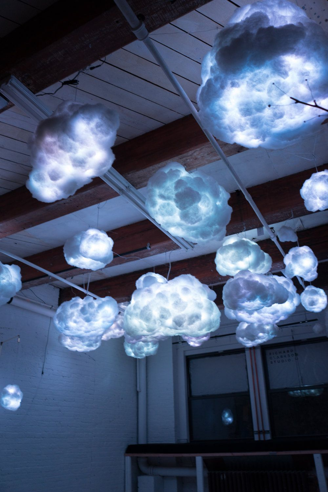

<!--- Fill out name and link to related project in the code below. --->
[Name of related project](https://www.youtube.com/watch?v=UQSZQZIuIk4)

<!--- Include information about why this project is related to yours. --->
This project is related to mine because at the beginning this was one of my biggest inspirations and i wanted to create something similar. I couldn’t copy a project that already exsits though so it just gave me an idea of what my design intent will be and the area that I’m interested in. I was going to include sound in my final project too but it is way out of my depth to create. It is a much larger project than what I’m creating but it still involves LED light which relates to my project.

### Slap It: Cheeky Interactive Lights ###

 https://design-milk.com/slap-cheeky-interactive-lights-joseph-begley/

 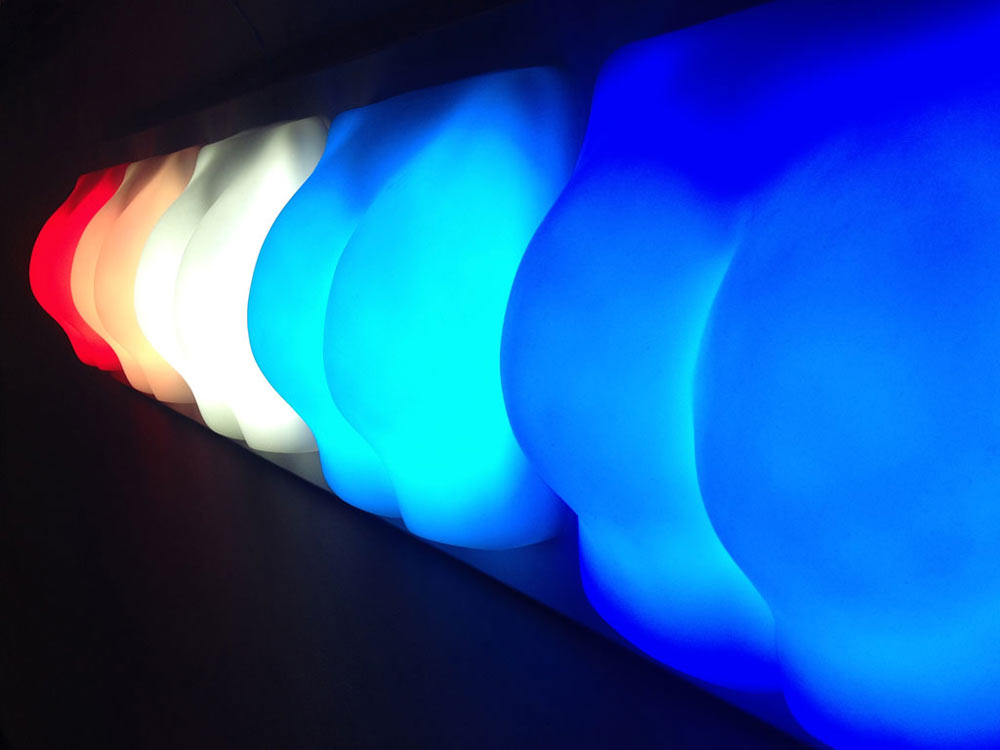

 This project is related to mine because again it includes LED lights and also requires touch to set off. The different coloured LED's is also related to mine as I would like to include different colours depending on touch or movement. I think this project is fun and looks enjoyable, I would like to include the same aspects in my final project. 

### CLOUD ###

 https://www.thisiscolossal.com/2012/09/an-interactive-cloud-made-of-6000-lightbulbs/

 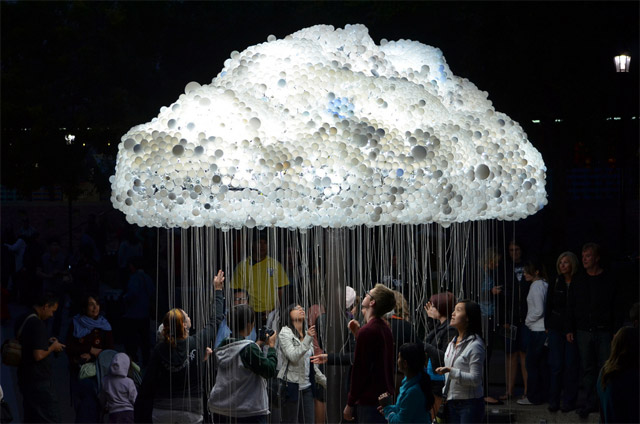
 
 The Cloud is a large scale project made with about 6,000 light bulbs that people can pull the chains causing the cloud to flicker. This project relates to mine as it has a similar design intent, which is to create light in the dark at night but still looks pretty during the day. It of course requires human interaction to make the project perform which is the same as my project.

### Notional Field ###

https://cuppetellimendoza.com/nervous-structure-field/

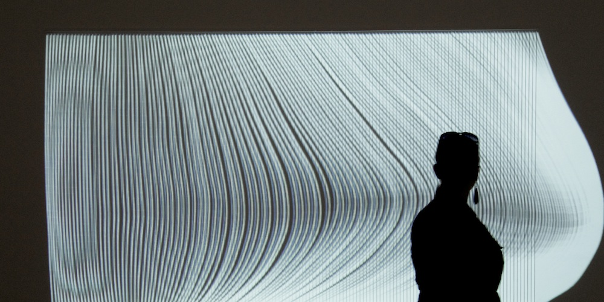

This project is influenced by a viewer’s movements by a built in video camera. It again involves light like my project but it is a much bigger scale and function very differently. I especially like the fluent movement of the elastic cords that act like soft rope.

### Infinity dress ###

https://snobette.com/2019/07/iris-van-herpen-infinity-dress-haute-couture-2019/

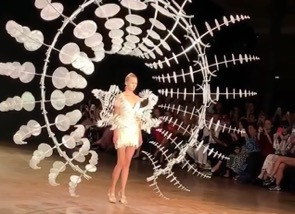

This is a runway dress whose moving part minimck the continual motion machine. The only relation this project has to mine is the material such a light but other than the project is very advanced but very inspirational. I added this into my related projects because i enjoy the visuals and th concepts, it is very inspiring for people wanting to work with lights or wearable installation.

### Breath of light ###

 https://www.youtube.com/watch?v=CfVTQ6jrqg0

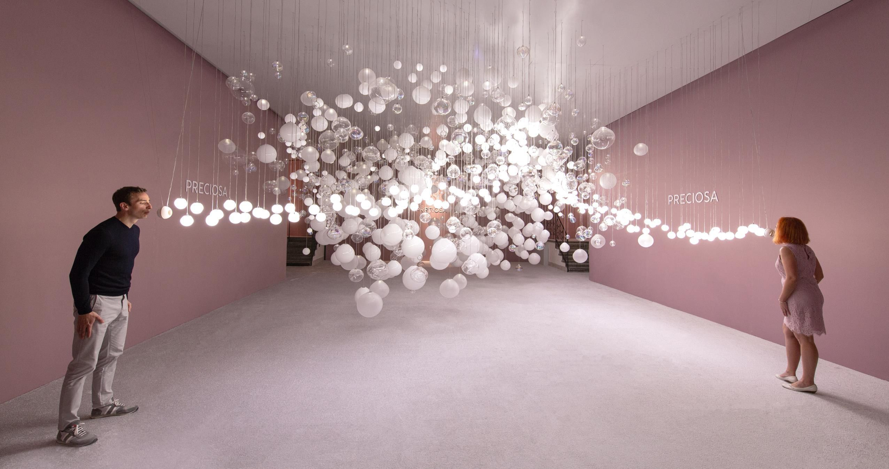

This project is related to mine because it involves lights and the aesthetic is beautiful which inspires me to create a final project that is also beautiful to look at. The lights turn on depending on the sensor which is kind of similar to mine where the lights depend on a particular variable.

<!--- Repeat code above for a total of 6 related projects --->

## Other research ##
<!--- Include here any other relevant research you have done. This might include identifying readings, tutorials, videos, technical documents, or other resources that have been helpful. For each particular source, add a comment or two about why it is relevant or what you have taken from it. You should include a reference or link to each of these resources. --->

Making compass 

https://makecode.microbit.org/projects/compass This page from Mircowas useful for my project as it help me wrap my head around the basics of compass coding which I have to include in my project.

https://www.youtube.com/watch?v=tzK1AKUiGy0 I found this video useful in terms of the compass coding. The tutorial explains all the steps and makes it easy to follow.

https://www.youtube.com/watch?v=4qckORHXuJU

Connecting LED lights

https://www.youtube.com/watch?v=yQ2-yVXFMeE I watched many videos similar to this one to help myself learn more about LED circut. All the videos that i watched are similar but some more than others relate to my project more. Although in my final project I will probably use crocodile clips instead of the breadboard but these videos still help me get an idea of the technical side.

https://www.youtube.com/watch?v=OlTcVX4W0yk Another connecting LED to breadboard youtube video.

## Conceptual development ##

### Design intent ###
<!--- Include your design intent here. It should be about a 10 word phrase/sentence. --->
The design intent for this project is a night light sutible for a side table, the light will be interactive with a nice aesthetic look.

### Design ideation ###
<!--- Document your ideation process. This will include the design concepts presented for assessment 2. You can copy and paste that information here. --->
### Design concept 1 ###
 Chair carousel 
I have 3 different concepts that all have a similar function. The first concept has a chair carousel look, it would small enough for a side table and the chairs would be replaced with 5 fairy lights. When you press the button at the base it will turn on the fairy lights and it will start rotating which makes the fairy lights attached fly out and around clockwise.

 Materials:
 - Mirco continous rotation servo 
 - Mircro bit 
 - 3x M/F jumper wires 
 - Fairy lights
 - String 
 - Wood/ wood pole

 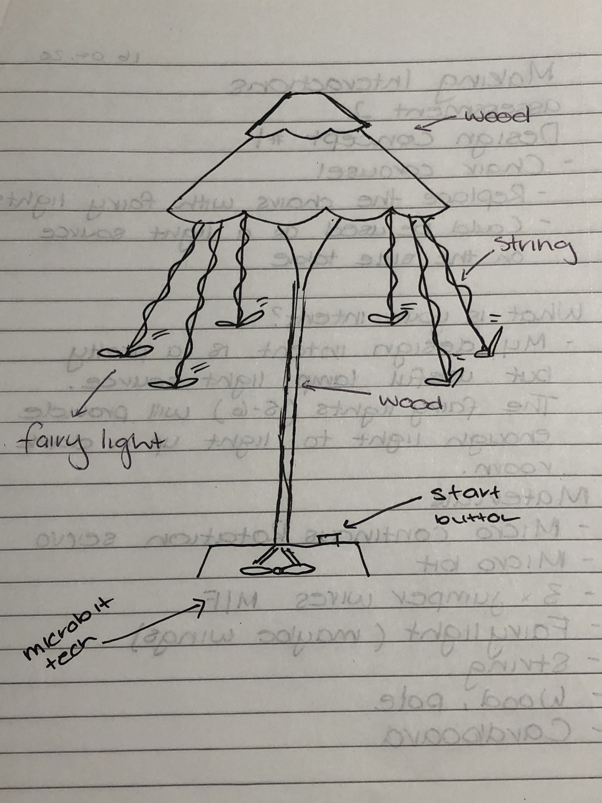

 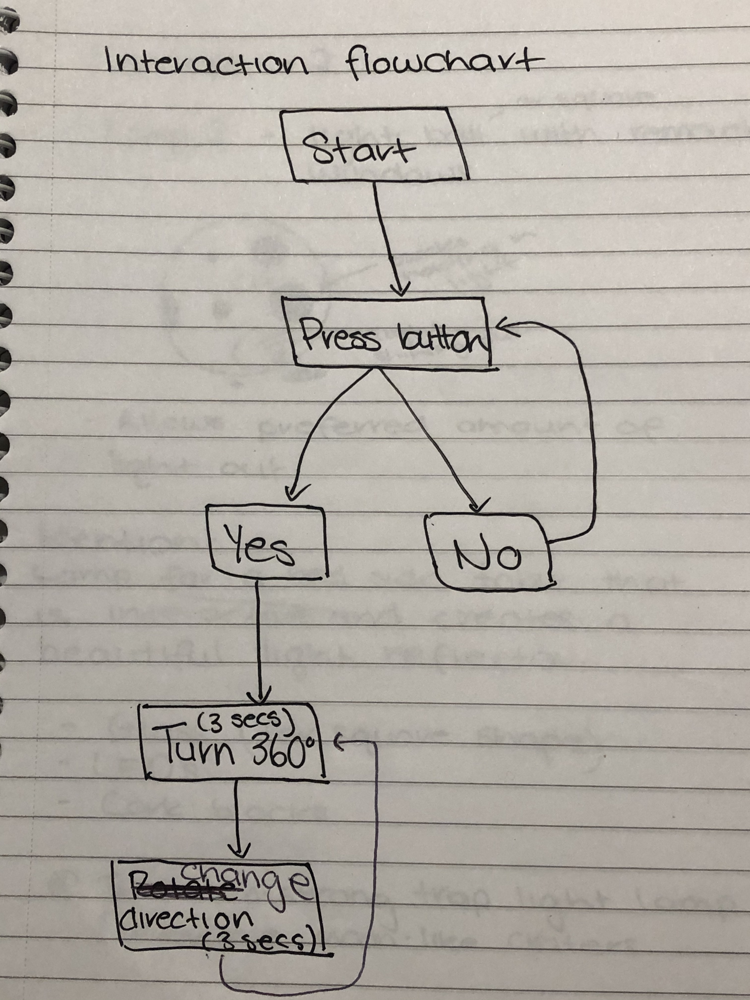

### Design concept 2 ###
Crater lamp
The crater lamp is also suitable for a side table that reflects a beautiful patterned light around the dark room. It allows preferred amount of light out through the holes. The lamp would be a acrylic cube with about 12 different sized holes arounf it, it would be a soild colour not allowing light out unless a cork block was removed from one of the holes.

 Materials:
 - Acrylic 
 - Cork blocks 
 - LED 
 - Mircobit 

 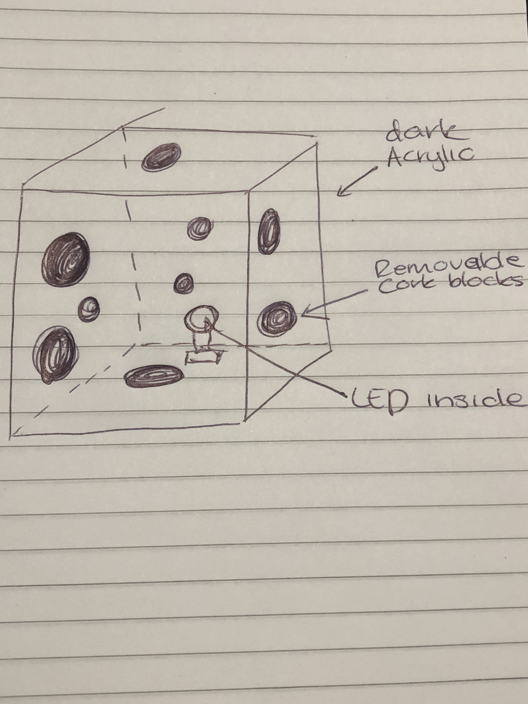

### Final design concept ###
<!--- This should be a description of your concept including its context, motivation, or other relevant information you used to decide on this concept. --->
Colourful night light 

My final design concept is a interactive night light that is a cube shape. It has four different LED colours that is connected to four different sides of the cube, depending on which side is facing up either green, yellow, orange or red will appear. It is dependent on a compass inside of the cube, each north, east, south and west have a different colour. This means the object will be a certain degree to make the colours change. The cube will be transparent enough for the LED to shine through but it will also hide the materials and tech inside of the cube. The light will be a size that can comfortably sit in one hand and can sit on the side table.

 Materials:
 - LED lights (Green, yellow, red, orange)
 - Mircobit 
 - Crocodile clips 
 - Acrylic or material for the cube
 - Tape

### Interaction flowchart ###
<!--- Include an interaction flowchart of the interaction process in your project. Make sure you think about all the stages of interaction step-by-step. Also make sure that you consider actions a user might take that aren't what you intend in an ideal use case. Insert an image of it below. It might just be a photo of a hand-drawn sketch, not a carefully drawn digital diagram. It just needs to be legible. --->

 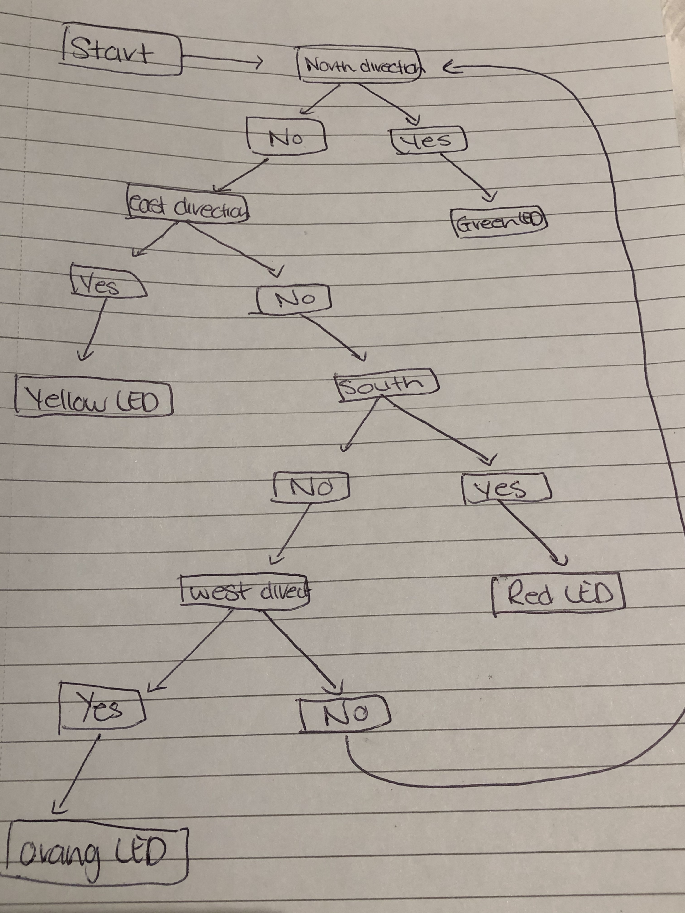

## Process documentation ##
<!--- In this section, include text and images (and potentially links to video) that represent the development of your project including sources you've found (URLs and written references), choices you've made, sketches you've done, iterations completed, materials you've investigated, and code samples. Use the markdown reference for help in formatting the material.

This should have quite a lot of information! It will likely include most of the process documentation from assessment 2 which can be copied and pasted here.

Use subheadings to structure this information. See https://guides.github.com/features/mastering-markdown/ for details of how to insert subheadings.

There will likely by a dozen or so images of the project under construction. The images should help explain why you've made the choices you've made as well as what you have done. --->

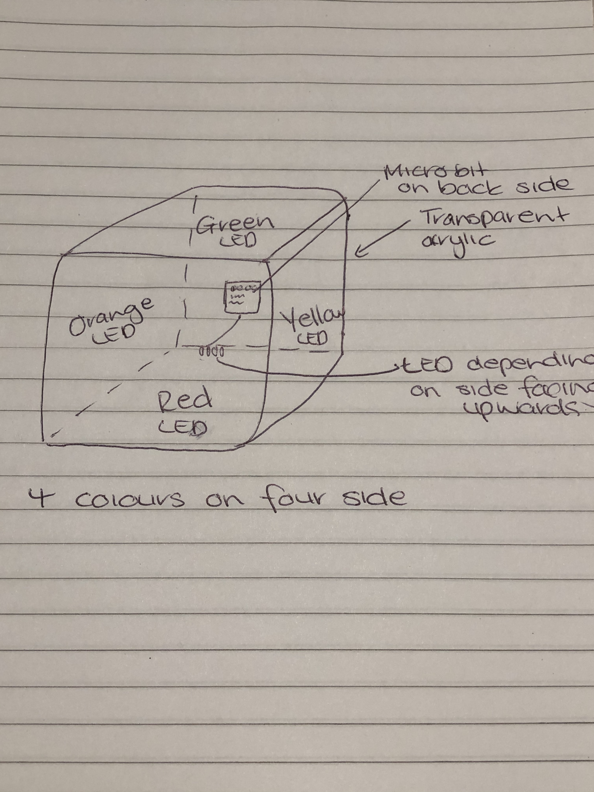

 This is a rough sketch of the night light. 

 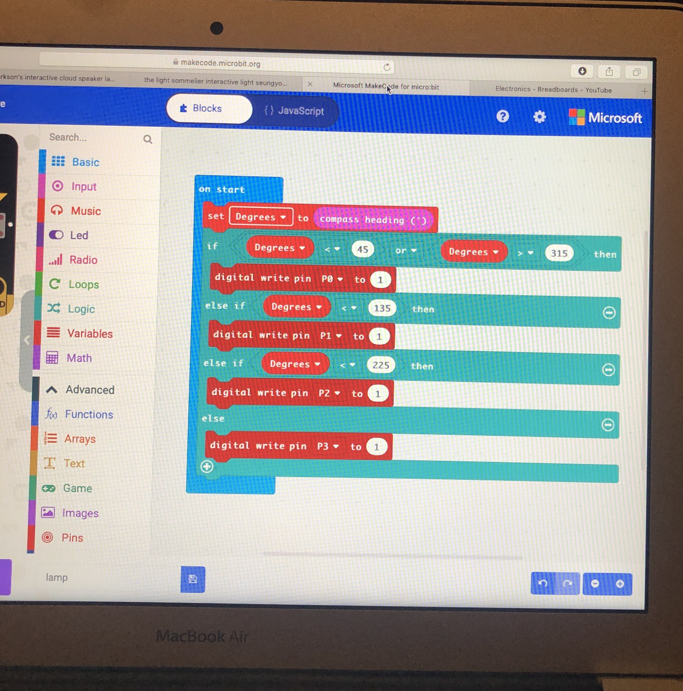

 This is a screenshot of my coding experimentation. Although I haven't got as far as I wanted with the technical side, I played around with coding and the bread board just to experiment what does and doesn't work. I haven't yet figured out the correct coding but with more research and materials for testing I will soon figure it out. This is my compass coding I've been working with and trying to figure out how to make the direction correspond with the LED. It still needs work and more test but it is a good starting point.

 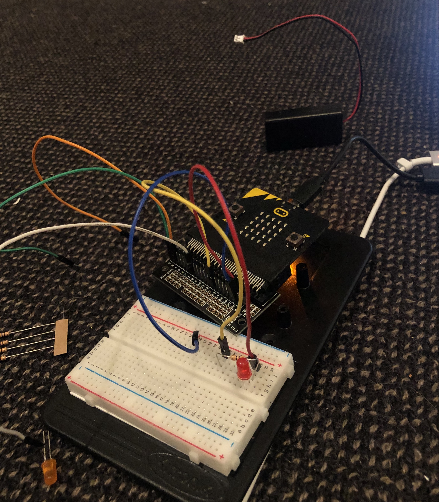

 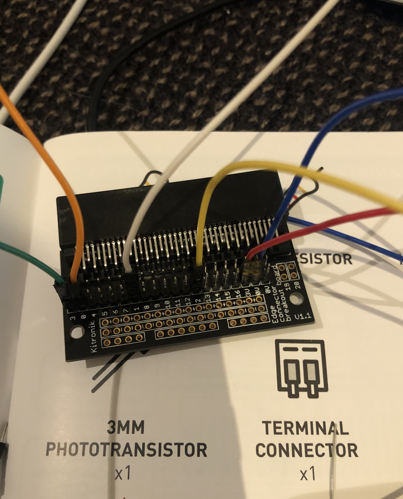

 This is the bread board and experimenting with one LED light first. I had to look back on pervious activities to get an idea of how it comes together. Again the technical side needs improvement and more development as I haven't yet figured it out completely.
 
 

## Final code ##

<!--- Include here screenshots of the final code you used in the project if it is done with block coding. If you have used javascript, micropython, C, or other code, include it as text formatted as code using a series of three backticks ` before and after the code block. See https://guides.github.com/features/mastering-markdown/ for more information about that formatting. ---> 
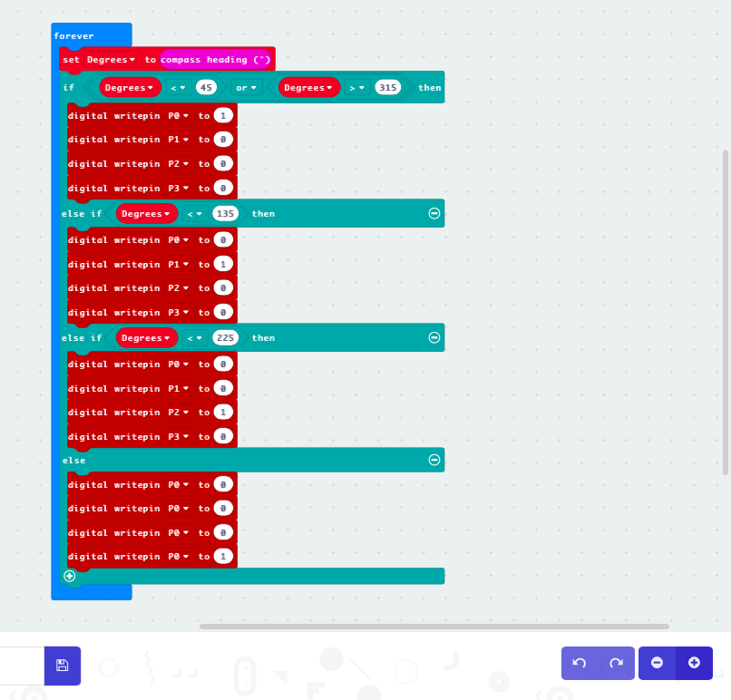

## Design process discussion ##
<!--- Discuss your process used in this project, particularly with reference to aspects of the Double Diamond design methodology or other relevant design process. --->
 In relation to the Double Diamond design through the planning phase I spent alot of time finding secondary research and brainstorming to bring together more ideas and possiblities for my project. The time spent on research was helpful to then focus on the define and development phase of the design process. Planning my materials to use was easier from my related projects I found, it gave me an idea of what works and what doesn't before testing it myself. The technical side of my project had a lot of trial and error, first I tried to set up the bread board with all the LED's which didn't work but then found it easier handing one LED at a time to then gradually work with all four LED's. It was the same situtaion with the coding, I keep trying to figure out the coding using all the directions and LED but I think I need to focus on one LED and working my way up. When following tutorials and videos it was easier to put the coding and bread board together and then adjusting it to suit my project. In my final project I will use crocodile clips instead of a breadboard because it is more suitable for concept. 
 
When i started using crocodile clips it took me a while to adjust and fit all the cords inside the box. After playing with it for a while it was better to use only 3 LED instead of 4 to reduce clutter and problems occuring. Also instead of connecting all the LED's to the GND on the mircobit it was better to connect them together with only one LED connected to the micro bit.  
 
 

## Reflection ##

What techniques, approaches, skills, or information did you find useful from other sources (such as the related projects you identified earlier)?

The related project that inspired me and was most helpful was the Interactive clouds, when I found this project I knew I wanted to work with lights because I loved the look and context behind it. It was a starting point for my entire project and made me look deeper into the technical side, possibilities and aesthetics of light projects. Once I figured out my design intent from related projects, then videos on YouTube become the biggest source of information and helped me develop the technical skills and coding. Other than related projects and YouTube videos being a major help in the success of my project, the online dashboard also provided me extra help and guidance when I need assist. 

What parts of your project do you feel are novel? This is IMPORTANT to help justify a key component of the assessment rubric.

As much as my project has related project with similar context and materials, my project still remains with parts that are dissimilar and novel. The novel parts of my project would first be the light depending on a compass, I researched many times using key words but never came across any lamp that required a compass. This particular technical idea is very unusual and different to lamps or project that already exist.
Another part of my project that I feel is novel is the design of the light, the marble wrap and the cube shape create a modern and clean look. This design isn't usually compatible or seen when it comes to a bed side table, especially with a red, orange and green light reflecting. Light projects or lamps project a solid cold white light so even including the different colours makes this project novel.  
My project has many parts that are novel that haven't been done in other projects and this makes my project very personal and innovative but at the same time it can be successfully depulicated for further interactive projects.

What might be an interesting extension of this project? In what other contexts might this project be used? --->

This project can be extended and explored in many ways from scale, context, colour, shape, etc. Although one interesting extension of this project could be on a larger scale and instead of the lights depending on the angle of the object, it could depend on movement through a sensor. It would be enlarged to a adults height so when a person moves around the object the light changes colour to the side that the person is infront of. This is one way to make my project more advanced and gives a different context as more people can explore it and interaction would be funner. 
